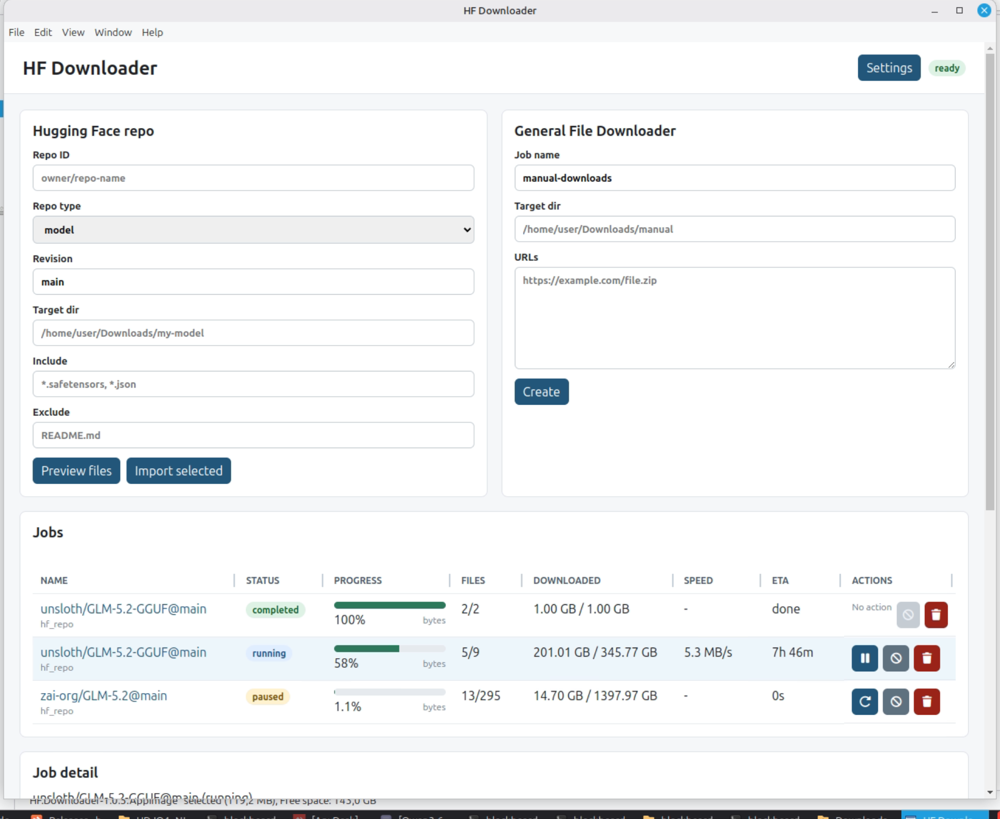
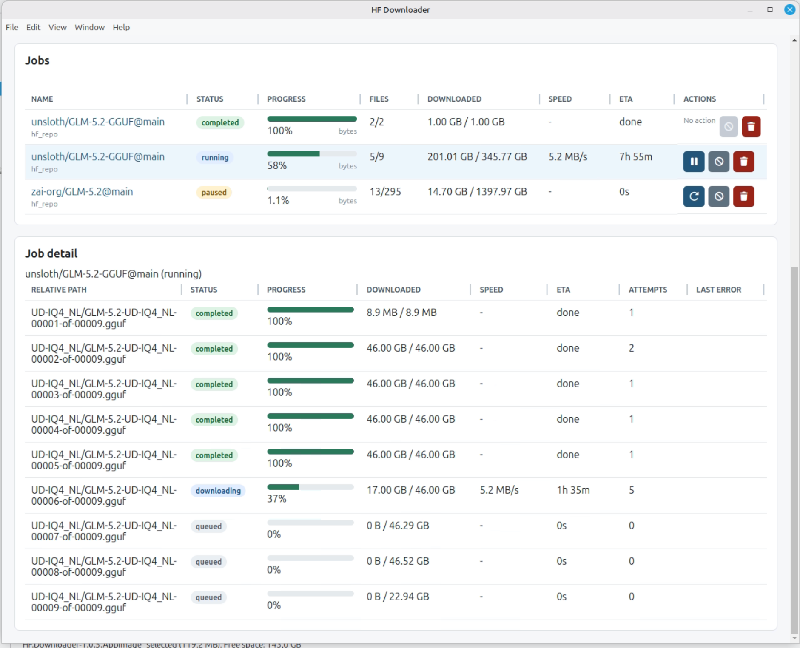
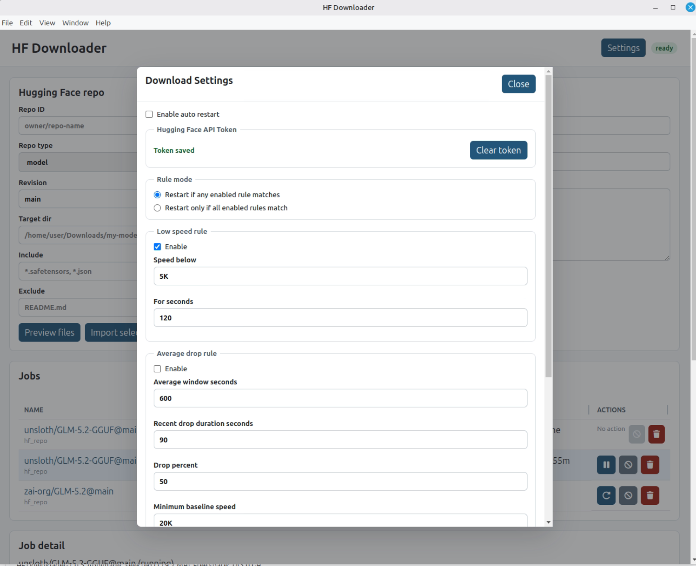

# HF Downloader

Local Hugging Face repo and general file download manager. It uses Node.js, Express, SQLite, vanilla browser JavaScript, and the system `aria2c` binary.

The app runs locally on Linux, macOS, and Windows. There is no account system, cloud sync, telemetry, or external backend service.

## Screenshots

### Dashboard



### Jobs and File Progress



### Download Settings



## Requirements

- Node.js 18 or newer
- npm
- `aria2c`

Check Node.js:

```bash
node --version
```

## Install aria2

### Linux Mint / Ubuntu / Debian

```bash
sudo apt update
sudo apt install aria2
```

### macOS

With Homebrew:

```bash
brew install aria2
```

### Windows

With winget:

```powershell
winget install aria2.aria2
```

Or install aria2 manually and make sure `aria2c.exe` is available in `PATH`.

If `aria2c` is missing, the app still opens and shows a system dependency panel. Use `Install aria2` to let the app run the platform installer when supported:

- macOS: `brew install aria2`
- Windows: `winget install aria2.aria2`
- Debian/Ubuntu/Linux Mint: `apt-get` via `pkexec` when available

If the platform installer is unavailable, the app shows the manual command to run.

## Install App

Linux/macOS:

```bash
npm install
cp .env.example .env
npm start
```

Windows PowerShell:

```powershell
npm install
Copy-Item .env.example .env
npm start
```

`npm start` rebuilds the native SQLite dependency for the current Node.js runtime before starting the web server.

Open:

```txt
http://localhost:3021
```

## Environment

Edit `.env`:

```env
PORT=3021
DOWNLOAD_ROOT=/home/YOUR_USER/Downloads/hf-downloader
LOWEST_SPEED_LIMIT=50K
ARIA2_TIMEOUT=60
ARIA2_RETRY_WAIT=10
```

On macOS or Windows, set `DOWNLOAD_ROOT` to a valid local path for your machine.

Examples:

```env
DOWNLOAD_ROOT=/Users/you/Downloads/hf-downloader
```

```env
DOWNLOAD_ROOT=C:\Users\you\Downloads\hf-downloader
```

`HF_DOWNLOADER_DATA_DIR` sets the directory used for the SQLite database (`app.db`). It defaults to a `data` folder next to the server. The Electron desktop app stores it under `userData/data` automatically, so release users do not need to set it.

## Hugging Face Token

For private or gated repos, enter the token in the `Hugging Face API Token` box on the dashboard and click `Save token`.

The token is stored locally in the app SQLite database. The backend uses it for Hugging Face API calls and `aria2c` Authorization headers. The token value is never returned by API responses; the UI only receives whether a token exists.

For source-code development, `HF_TOKEN` in `.env` is still supported as a fallback, but release users should not need to edit `.env`.

## Hugging Face Repo Download

Set `HF download root` in Settings before importing Hugging Face repos. Repos are downloaded under `owner/repo-name` folders inside that root.

Example:

```txt
HF download root: /home/you/Models
repoId: unsloth/MiniMax-M3-GGUF
download target: /home/you/Models/unsloth/MiniMax-M3-GGUF
```

Example model:

```txt
repoId: owner/model-name
repoType: model
revision: main
include: *.safetensors, *.json
exclude:
```

Example dataset:

```txt
repoId: owner/dataset-name
repoType: dataset
revision: main
include: *.parquet, *.json
exclude:
```

Use `Preview files` before importing when you want to choose files manually. The preview opens in a modal where you can filter, select all files, select only visible filtered files, or uncheck any file. `Import selected` creates a job only for the selected files. Include/exclude patterns are still available for quick filtering.

## General File Downloader

Use the General File Downloader form:

```txt
job name: manual-downloads
targetDir: /home/you/Downloads/manual
URLs:
https://example.com/file1.zip
https://example.com/file2.zip
```

Click `Create`, then `start`.

## Pause, Resume, Cancel, Delete

Each job downloads files sequentially. Pause sends `SIGTERM` to the active `aria2c` process. Resume starts the same file again with `aria2c -c`, so existing partial files are reused.

If the server restarts while a job is running, active files are moved back to `queued` and the job is marked `paused`. Press `resume` to continue from the partial files.

`cancel` stops a job and leaves its row in the database with `cancelled` status. `delete` removes the job row and its file rows from SQLite, but it does not delete downloaded files from disk.

## Job Detail

Click a job name to open its detail panel. It lists every file in the job with status (`queued`, `downloading`, `paused`, `completed`), size, downloaded bytes, and live speed for the active file. The active job's speed is also shown in the jobs table.

## Speed and Auto Restart

The dashboard shows downloaded bytes and current speed. Active progress is read from aria2 progress output, not from filesystem file size, because some filesystems may preallocate or expose sparse files at their final size before all bytes are downloaded.

Auto restart can be configured from the dashboard `Settings` modal. It supports:

- low-speed rule
- average-drop rule
- `any/all` rule matching
- restart limits per file/job
- cooldown seconds

Auto restart is disabled by default.

The dashboard `Settings` modal also manages the Hugging Face token and includes `Reset defaults` to restore the auto-restart configuration. The download forms persist their last values in the browser, so a refresh keeps your previously typed repo, target dir, and patterns.

## Model Indexer

Use the `Models` button to open the local model index. Configure model roots in `Settings` under `Model Indexer`, one directory per line, for example:

```txt
/home/you/Models
```

Click `Scan now` in the Models modal to recursively scan those roots. The scan status and progress bar show discovery and indexing progress while large model folders are being processed. The indexer detects:

- `.gguf` files
- `.safetensors` files
- Diffusers folders containing `model_index.json`

The model table shows domain, format, architecture, creator, base/fine-tune hints, quantization, precision, and size. Click a model table header to sort by that column. Hover over a model name to see its local path. Metadata is read from GGUF headers, SafeTensors headers, Diffusers configs, and filename/folder-name heuristics. Multi-part GGUF and SafeTensors shards such as `00001-of-00009` are grouped into one model row with a combined size. Some fields are best-effort because many local model files do not store creator, base model, or fine-tune information explicitly.

## API Endpoints

```txt
GET    /api/health
GET    /api/system/aria2
POST   /api/system/aria2/install
GET    /api/settings/hf-token
PUT    /api/settings/hf-token
DELETE /api/settings/hf-token
GET    /api/settings/download-policy
PUT    /api/settings/download-policy
GET    /api/settings/model-roots
PUT    /api/settings/model-roots
GET    /api/settings/hf-download-root
PUT    /api/settings/hf-download-root
GET    /api/models
GET    /api/models/:id
POST   /api/models/scan
GET    /api/models/scan/status
GET    /api/jobs
GET    /api/jobs/:id
POST   /api/jobs
POST   /api/hf/files
POST   /api/hf/import
PUT    /api/jobs/:id/start
PUT    /api/jobs/:id/pause
PUT    /api/jobs/:id/resume
PUT    /api/jobs/:id/cancel
DELETE /api/jobs/:id
GET    /api/jobs/:id/files
```

## Electron Desktop App

Electron support is included. The Electron main process starts the local Express server on an available localhost port, opens a BrowserWindow, and shuts the server down when the app exits.

Run the desktop app during development:

```bash
npm run electron
```

Build release artifacts. All commands below can be run from any OS and cross-build for the target platforms, since `better-sqlite3` prebuilt binaries are downloaded per platform:

```bash
npm run dist:mac      # macOS .dmg
npm run dist:win      # Windows x64 .exe installer + portable
npm run dist:linux    # Linux x64 .deb + .AppImage
npm run dist:all      # all of the above
```

Or request all configured targets at once:

```bash
npm run dist:all
```

For Linux arm64:

```bash
npm run dist:linux:arm64
```

Configured targets:

- Windows: `.exe` installer and portable executable (x64)
- Linux: `.deb` and `.AppImage` (x64, arm64 via `dist:linux:arm64`)
- macOS: `.dmg`

Packaging notes:

- `aria2c` must either be bundled per platform or detected as a system dependency.
- Current implementation detects system `aria2c`; bundling platform-specific `aria2c` binaries can be added later for a smoother release.
- `better-sqlite3` is native. `npm start` rebuilds for Node.js. `npm run electron` and `npm run dist:mac` rebuild for the local Electron runtime; Windows/Linux package builds download prebuilt native binaries for the target architecture via `prebuild-install`.
- macOS `.dmg` signing/notarization requires Apple Developer tooling for a polished public release.
- Windows signing is optional for testing but useful for reducing security warnings.

## Notes

- No CORS is used. The frontend is served by the same Express server.
- No TypeScript, bundler, frontend framework, account system, sync, cloud service, or telemetry is used.
- Physical downloaded files are not deleted when a job is cancelled or deleted from the UI.
- Default concurrency is one file at a time.
- Press `Esc` to close the file preview, Models, and Settings modals.
- Modals can be resized from the bottom-right corner. Modal sizes are remembered for the current browser session.
